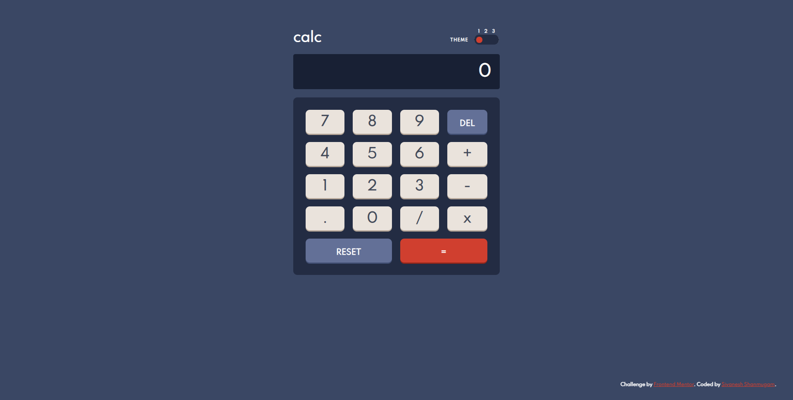
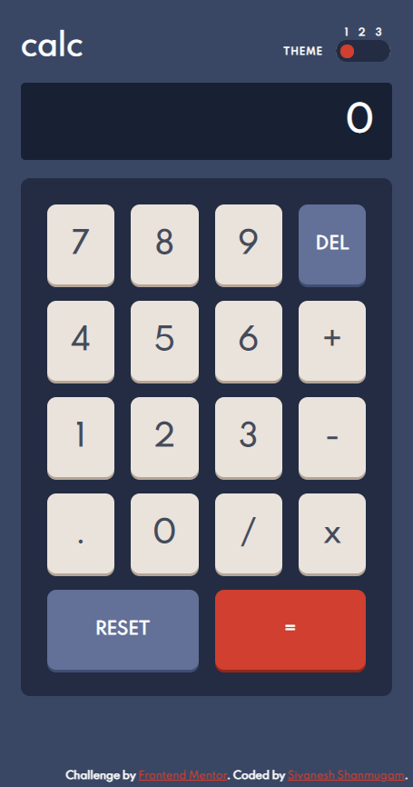

# Frontend Mentor - Calculator app solution

This is a solution to the [Calculator app challenge on Frontend Mentor](https://www.frontendmentor.io/challenges/calculator-app-9lteq5N29). Frontend Mentor challenges help you improve your coding skills by building realistic projects. 

## Table of contents

- [Overview](#overview)
  - [The challenge](#the-challenge)
  - [Screenshot](#screenshot)
  - [Links](#links)
- [My process](#my-process)
  - [Built with](#built-with)
  - [What I learned](#what-i-learned)
- [Author](#author)

## Overview

### The challenge

Users should be able to:

- See the size of the elements adjust based on their device's screen size
- Perform mathmatical operations like addition, subtraction, multiplication, and division
- Adjust the color theme based on their preference
- **Bonus**: Have their initial theme preference checked using `prefers-color-scheme` and have any additional changes saved in the browser

### Screenshot

### Links

- [Solution URL](https://github.com/Sivanesh-S/frontend-challenges/tree/main/calculator-app-main)
- [Live Site URL](https://sivanesh-s.github.io/frontend-challenges/calculator-app-main/)

## My process

### Built with

- Semantic HTML5 markup
- CSS3 and variables
- Flexbox
- CSS Grid
- Vanilla JS

### What I learned

- I'm basically a professional react developer. In this project I tried this using vanilla JS. As an Amateur in UI developing, these challenges helps me to learn.

## Author

- Website - [Sivanesh Shanmugam](https://sivanesh-s.github.io)
- Frontend Mentor - [@Sivanesh-S](https://www.frontendmentor.io/profile/Sivanesh-S)
- Twitter - [@Sivanesh-Fiz](https://www.twitter.com/sivanesh-fiz)
